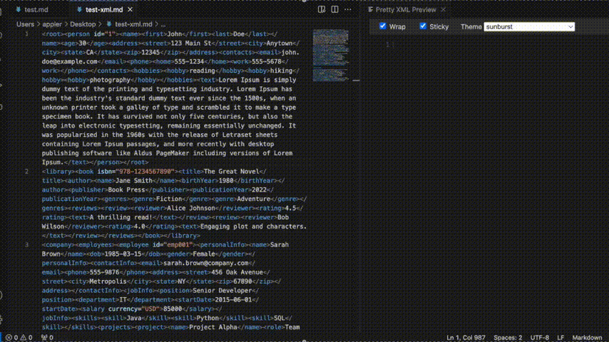

# Pretty XML Preview

Select your XML in the editor and instantly preview well formatted XML in a side panel!

No extra commands, no key combinations required!

> *Pretty XML Preview extension never submits any information to any third-party websites or external APIs. All the formatting happens locally and on the fly.*

## Features

- Formats and prettifies XML in a separate panel
- Real-time updates as you select different XML text
- Syntax highlighting for better readability
- Supports escaped XML string

## Usage

1. Open the Command Palette (Ctrl+Shift+P on Windows/Linux, Cmd+Shift+P on macOS)
2. Type and find "Pretty XML Preview: Open" command and select it to open the side panel
3. Select a XML text in your active editor
4. The selected XML will automatically be prettified in the side panel
5. As you change your selection, the prettified XML updates in real-time

### Toolbar

- Wrap - toggles word wrap
- Sticky - keeps the latest XML even your text selection changes
- Theme - pick the best highlighting theme for your taste

## Installation

1. Open Visual Studio Code
2. Go to the Extensions view (Ctrl+Shift+X or Cmd+Shift+X on macOS)
3. Search for "Pretty XML Preview"
4. Click Install

Alternatively, you can download the `.vsix` file from the releases page and install it manually.

## Requirements

This extension requires Visual Studio Code version 1.60.0 or higher which was released in August 2021.

## Contributing

Contributions are welcome! Please feel free to submit a Pull Request.

Please create an issue on [Github](https://github.com/appler1009/vscode-xml-prettify/issues) if you have any XML documents that are not formatted as expected or if you experience any erratic behavior.

If you enjoy this extension and find it helpful, consider supporting through [Buy Me a Coffee](https://buymeacoffee.com/applerk). Your contributions help me continue to improve this project and create more valuable tools for the community. Every "coffee" you buy goes a long way in motivating me to keep developing and sharing my passion for software. Thank you for your support!

## Acknowledgements

- The icon from [Xml icons created by LAB Design Studio - Flaticon](https://www.flaticon.com/free-icons/xml)

### Pretty Previewers

Don't miss out on my companion extensions, [Pretty JSON Preview](https://marketplace.visualstudio.com/items?itemName=appler.pretty-json-preview) and [Pretty SQL Preview](https://marketplace.visualstudio.com/items?itemName=appler.pretty-sql-preview). They are the perfect complement to this tool!

## Releases and Notes

[Releases and Notes](https://github.com/appler1009/vscode-xml-prettify/releases)

## License

This extension is licensed under the [MIT License](LICENSE).

---

**Enjoy!**